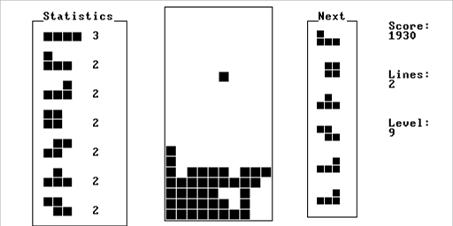

# Tetris

This is the Jack implementation of [tetris](https://tetris.com) by Alexey Pajitnov.

[//]: # (Generated with `ffmpeg -ss 00:01:00.000 -i in.mov -pix_fmt monob -r 20 -s 512x256 -t 00:00:15.000 demo.gif`)



## Tetris rules

The tetris guideline can be found at

[Tetris guideline](https://tetris.fandom.com/wiki/Tetris_Guideline)

### Included

- [Scroing](https://tetris.fandom.com/wiki/Scoring#Guideline_scoring_system) based on [zone.tetris](https://web.archive.org/web/20070623041317/http://zone.tetris.com/page/manual)
  - With the exception of:
    - T-spin score
    - Combo score
- [Gravity](https://tetris.fandom.com/wiki/Tetris_Worlds#Gravity)
- [7-bag Random Generator](https://tetris.fandom.com/wiki/Random_Generator)
- [Standard Rotation System](https://tetris.fandom.com/wiki/SRS)
- [Wall kicks](https://tetris.fandom.com/wiki/SRS#Wall_Kicks)
- Fixed goal level up (10 lines)
  - With the exception of:
    - T-spin level up

### Excluded

- [T-spin](https://tetris.fandom.com/wiki/T-Spin)
- [Floor kicks](https://tetris.fandom.com/wiki/Floor_kick)
- [Hold piece](https://tetris.fandom.com/wiki/Hold_piece)
- [Logo](https://tetris.wiki/File:The_Tetris_Company_logo.png)

## Design

| File                    | Prupose                                                       | Key methods                                                                  |
|-------------------------|---------------------------------------------------------------|------------------------------------------------------------------------------|
| `Algorithm.jack`        | General purpose algorithms                                    | `mod` - Return the modulus                                                   |
|                         |                                                               | `intInArray` - Check if an integer is in the array                           |
| `Background.jack`       | Background which tetrominos can be drawn on                   | `collapse` - Collapse full rows                                              |
|                         |                                                               | `drawFrame` - Draw the full frame                                            |
|                         |                                                               | `drawMesh` - Draw a mesh on the background                                   |
|                         |                                                               | `drawRows` - Draw specific row in a certain color (used for blinking effect) |
|                         |                                                               | `clearLinesAnimation` - Animate clear lines                                  |
| `LCGRandom.jack`        | Random number generator                                       | `randRange` - Return a random int                                            |
| `Main.jack`             | The main function                                             | `main` - Draws the splash screen, sets the seed and runs the game            |
| `Mesh.jack`             | A mesh where elements have state 0 or 1                       | `getState` - Get the state of an element                                     |
|                         |                                                               | `setState` - Get the state of an element                                     |
|                         |                                                               | `addTetrominoToMesh` - Add a tetromino to the mesh                           |
| `NextTetrominos.jack`   | Generate, return and display the next tetrominos              | `getNextTetromino` - Return the next tetromino                               |
|                         |                                                               | `generateBag` - Generate a 7-bag of tetrominos using                         |
| `Score.jack`            | Update and display the score (including line and level count) | `updateScore` - Update the score                                             |
|                         |                                                               | `updateLine` - Update the line count                                         |
|                         |                                                               | `updateLevel` - Update the level                                             |
| `SplashScreen.jack`     | Display splash screen and set random number seed              | `printSplashScreen` - Print the splash screen and return the seed            |
| `Statistics.jack`       | Update and display the statistics                             | `updateCounter` - Update the count of a specific tetromino                   |
| `TetrisGame.jack`       | Updaate the model of the game                                 | `run` - Run the game until game over                                         |
|                         |                                                               | `tetrominoFall` - Let the tetromino fall and move                            |
|                         |                                                               | `removeFullLines` - Remove any lines needing removaljk                       |
|                         |                                                               | `updateGameSpeed` - Update the game speed                                    |
| `Tetromino.jack`        | Manipulate individual tetrominos                              | `moveDown` - Move the tetromino down                                         |
|                         |                                                               | `moveLeft` - Move the tetromino down                                         |
|                         |                                                               | `moveRight` - Move the tetromino down                                        |
|                         |                                                               | `rotate` - Rotate the tetromino clockwise with wall kick (if applicable)     |
| `TetrominoSpawner.jack` | Spawn individual tetrominos                                   | `spawn{I,J,L,O,S,T,Z}` - Spawn a tetromino                                   |

## Implementation details

### Wall kick data

Translated from [wall kicks](https://tetris.fandom.com/wiki/SRS#Wall_Kicks), on the form `(y-index, x-index)`

#### For the I teromino

| Rotaion state from >> Rotation state to | Test 2  | Test 3  | Test 4   | Test 5   |
|-----------------------------------------|---------|---------|----------|----------|
| 0>>1                                    | (0, -2) |  (0, 1) | (-1, -2) |  ( 2, 1) |
| 1>>2                                    | (0, -1) | (0, 2)  | ( 2, -1) | (-1, 2)  |
| 2>>3                                    | (0, 2)  | (0, -1) | ( 1, 2)  | (-2, -1) |
| 3>>0                                    | (0, 1)  | (0, -2) | (-2, 1)  | ( 1, -2) |


#### For the J, L, T, S, Z terominos

| Rotaion state from >> Rotation state to | Test 2  | Test 3   | Test 4    | Test 5   |
|-----------------------------------------|---------|----------|-----------|----------|
| 0>>1                                    | (0, -1) | ( 1, -1) | (-2, 0, ) | (-2, -1) |
| 1>>2                                    | (0, 1)  | (-1, 1)  | ( 2, 0, ) | ( 2, 1)  |
| 2>>3                                    | (0, 1)  | ( 1, 1)  | (-2, 0, ) | (-2, 1)  |
| 3>>0                                    | (0, -1) | (-1, -1) | ( 2, 0, ) | ( 2, -1) |

### Frame calculations

(0-I, 1-J, 2-L, 3-O, 4-S, 5-T, 6-Z)

Screen: 256 rows of 512 pixels

### Calculation of the backgrounds

### Play field

The play field is given as `10x20`.
As the screen is `256x512` pixels the `max(elementSize)` is constrained in the vertical direction.

#### Calculating the maximum `elementSize`

This means that the largest block is set by `number_of_vertical_pixels/20`.
We also want some padding.
We want one pixel separation between the top and bottom of the screen and the frame, and one pixel between the top and the bottom between the frame and the tetromino element.
If we add the frame itself we will have 6 pixels in total we cannot use for tetrominos.

Each element will in the vertical direction occupy: `elementSize + 1` (`+1` for padding at the bottom).
As we don't want two paddings between the frame and the bottom element, we have 5 pixels we cannot use for tetrominos in the vertical direction.

We can now calculate the max `elementSize` by demanding that the "left-over pixels" are less than the `elementSize`

```text
256 - 5 - 20*(elementSize + 1) > elementSize
251 - 20*elementSize - 20 *1 > elementSize
231 > elementSize + 20*elementSize
231 > 21*elementSize
231/21 > elementSize
11 > elementSize
```

Thus `max(elementSize)=10`.

#### Calculating `frameLenY`

All 20 blocks will therefore occupy

```text
[Num blocks] * (size + spacing + [1 for the start position of next block])
20*(10 + 1 + 1) = 240
```

In addition we must reserve one pixel for the top-padding between the frame and the tetromino, and one pixel for the bottom frame.
With this we get that `frameLenY=242`.

#### Calculating `frameLenX`

As we have 10 blocks in the x directions, we find that

```text
[Num blocks] * (size + spacing + [1 for the start position of next block])
10*(10 + 1 + 1) = 120
```

In addition we must reserve one pixel for the left-padding between the frame and the tetromino, and one pixel for the right frame.
With this we get that `frameLenX=122`.

#### Calculating `frameStartY`

Next, we would now like to calculate `frameStartY`.
We can do this by demanding that we need equal padding at the top and the bottom.
We find that `padding=256-242 = 14`, so that

```text
frameStartY =
(14 - bottom line - top line)/2 =
(14 - 2)/2 =
12/2 = 6
```

Thus, we get `frameStartY = 6`.

#### Setting `frameStartX`

`frameStartX` is set by the screen should look visually appealing for the author.

#### Calculating the `Statistics` frame and the `Next` frame

Similar calculation can be made for the the `Statistics` frame and the `Next` frame with the following constraints:

1. The text should start on the second line (there text has `23 rows x 64 characters`)
2. There will be padding of one cell between the top, bottom, left and right of the frames

## Helpful resources

- Notes about memory management: [Ray tracer](https://blog.alexqua.ch/posts/from-nand-to-raytracer/) with [source code](https://github.com/aquach/from-nand-to-raytracer)

### Random number generator

- [Linear Congruential Generator](https://web.archive.org/web/20201022060109/http://nand2tetris-questions-and-answers-forum.32033.n3.nabble.com/Pseudo-Random-Number-Generator-td4026059.html), **NOTE**: The bug in `randRange` (addressed by Mark in some posts below)
- [LFSR32Rand](https://web.archive.org/web/20200126223144/http://nand2tetris-questions-and-answers-forum.32033.n3.nabble.com/LFSR32Rand-A-new-Random-Number-Generator-for-Jack-td4029928.html)
- [Coursea thread 1](https://www.coursera.org/learn/nand2tetris2/discussions/forums/I-Q0YCj3EeaZ8Apto8QB_w/threads/JsMZ_mRTTEmDGf5kU5xJHQ)
- [Coursera thread 2](https://www.coursera.org/learn/nand2tetris2/discussions/forums/I-Q0YCj3EeaZ8Apto8QB_w/threads/LiyUrABwEee0IhLPmsG3Vg)
